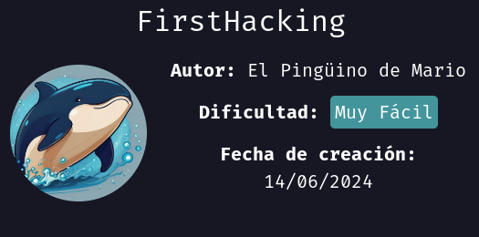
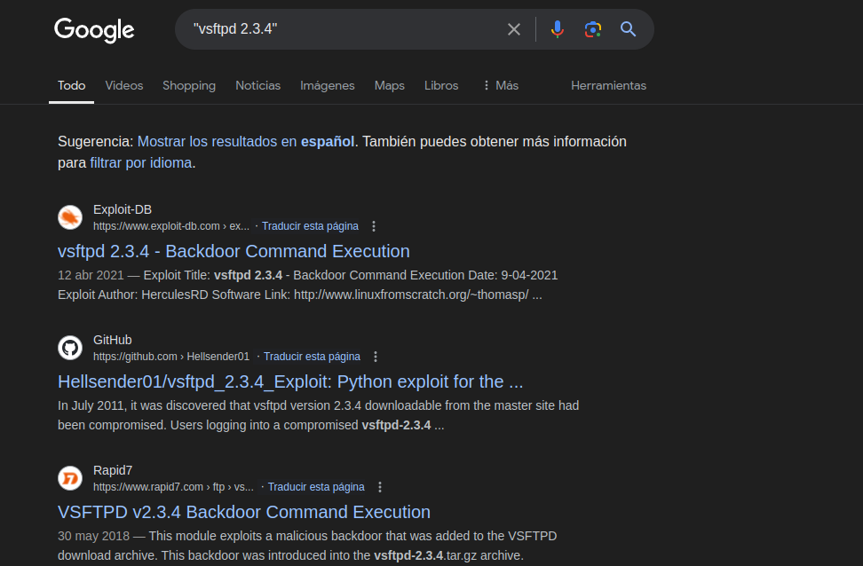
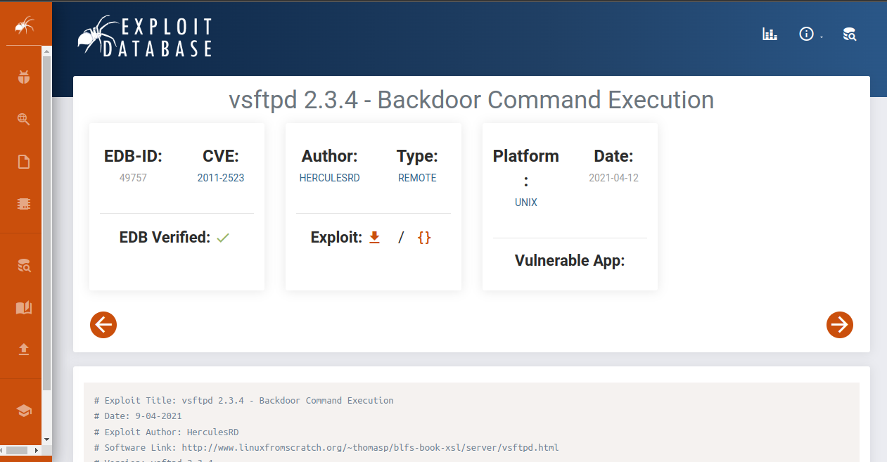

---
title: 'FirstHacking - DockerLabs'
description: "En este write-up, haremos la maquina FirstHacking de la plataforma DockerLabs"
pubDate: 'Sep 5 2024'
categories: ['WriteUp', 'DockerLabs']
--- 

## Introducción



```
Platform: DockerLabs
Level: Very Easy
```

## Desplegando la máquina

Primero, descargamos la máquina desde la página oficial de [DockerLabs](https://dockerlabs.es)


Una vez descargada, veremos que está comprimida. Procedemos a la extracción mediante una herramienta de descompresión. En mi caso, usaré **Unzip**.


Una vez extraídos los archivos, ejecutaremos la maquina


Una vez desplegada la máquina, nos indicará la **Dirección IP** objetivo y que, al terminar con la máquina, la eliminemos mediante **CTRL + C**.

## Enumeración
```
Target IP: 172.17.0.2
```
<br>

Primero, verificaremos la conectividad con la máquina objetivo mediante el comando `ping -c 1 172.17.0.2`.

Una vez verificada la conexión, podemos observar que se trata de una máquina **Linux**, esto se debe a que el **TTL=64** (Time To Live es igual a 64).


Procedemos a hacer un escaneo de servicios y puertos abiertos con la herramienta de escaneo de redes **Nmap**.

- `sudo`: Ejecuta el comando con privilegios de superusuario.
- `nmap`: Herramienta de escaneo de redes.
- `-p-`: Escanea todos los puertos (del 1 al 65535).
- `--open`: Muestra solo los puertos que están abiertos.
- `-vvv`: Modo muy detallado (muestra más información durante el escaneo).
- `-sS`: Escaneo TCP SYN, conocido como escaneo "sigiloso" porque no completa el handshake.
- `-Pn`: Omite la detección de host (asume que el host está activo).
- `-n`: No resuelve nombres de host (no intenta convertir IP a nombres).
- `--min-rate 5000`: Establece una tasa mínima de paquetes por segundo (aumenta la velocidad del escaneo).
- `172.17.0.2`: Dirección IP del objetivo.
- `-oG firstHacking-scan`: Guarda los resultados en formato "Grepable" en el archivo `firstHacking-scan`.


Como vemos, tenemos el puerto **21/tcp** que corre el servicio **FTP**. Haremos un escaneo específico a ese puerto con las flags `-sC` y `-sV`.

- `-p21`: Escanea solo el puerto 21 (**FTP**).
- `-sC`: Ejecuta **scripts Nmap estándar** (escaneo de scripts predefinidos para **obtener más información sobre el servicio**).
- `-sV`: Detecta la **versión del servicio** que se está ejecutando en el puerto.
- `172.17.0.2`: **Dirección IP** del host objetivo.


Como vemos, hay información sobre la **versión** del puerto **FTP**. La versión es `vsftpd 2.3.4`. Buscaremos en Google esa versión para encontrar una posible vulnerabilidad.



Encontramos un **Backdoor Command Execution** en la página de **Exploit Database (ExploitDB)**, una base de datos de exploits y técnicas de explotación mantenida por Offensive Security.



ExploitDB permite buscar exploits y vulnerabilidades en su base de datos desde la **línea de comandos**. Esto lo haremos mediante la herramienta **searchsploit**


## Explotación

Usaremos el exploit para `vsftpd 2.3.4 - Backdoor Command Execution`, aunque también es posible usar el de **Metasploit**.

Utilizaremos el comando de la herramienta `searchsploit -m unix/remote/49757.py`.

- `searchsploit`: Herramienta que busca exploits en la base de datos Exploit-DB.
- `-m`: Opción para copiar (mirroring) el exploit a tu sistema local.
- `unix/remote/49757.py`: Ruta del exploit específico (en este caso, es un exploit remoto para sistemas Unix) con el ID 49757, que es un script en Python.


Con el script descargado en nuestro sistema, lo ejecutaremos usando **python3**, el **script** y especificando la **dirección IP** del host objetivo.


Una vez dentro, ejecutamos el comando `whoami` o `id` y, como vemos, somos **root**.


También podríamos utilizar el comando `script /dev/null -c bash`, el cual ejecuta una sesión de `bash` mientras redirige la salida de `script` a `/dev/null`, lo que significa que no guarda el registro de la sesión en un archivo.


Una vez dentro, ya hemos obtenido control total y, por ende, damos por concluida la máquina.