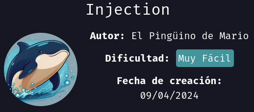
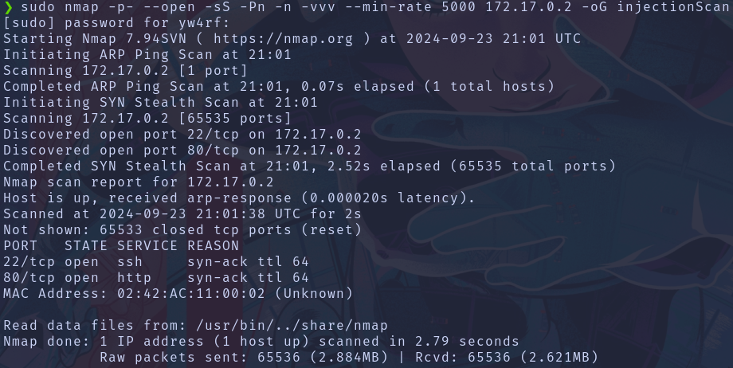
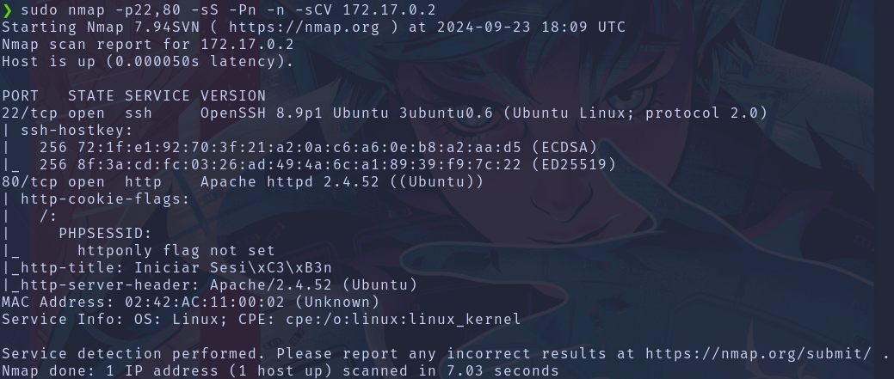
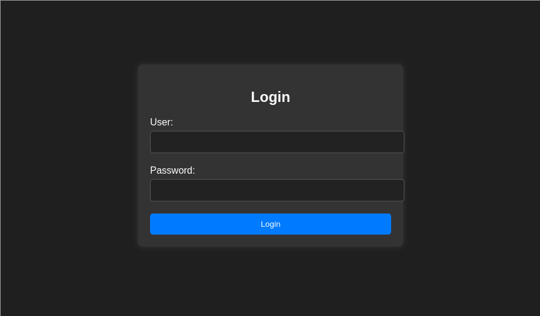
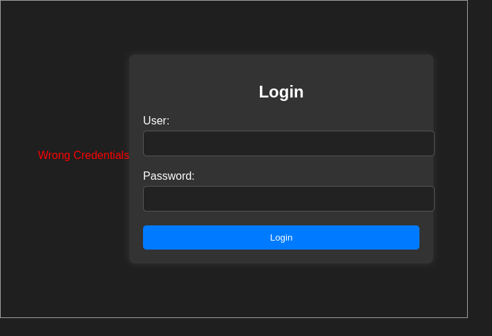
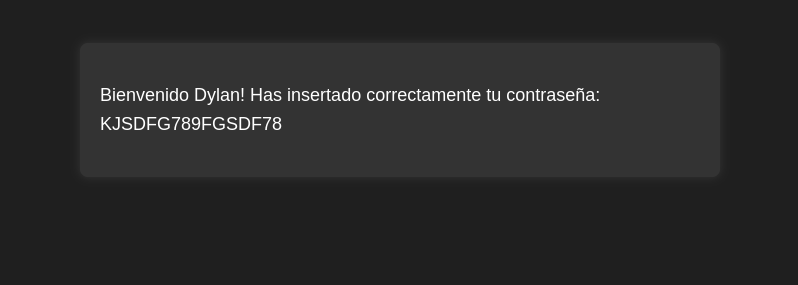
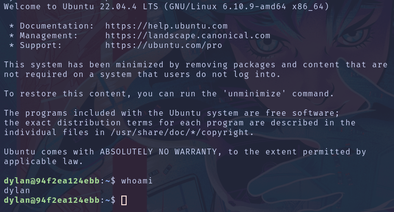
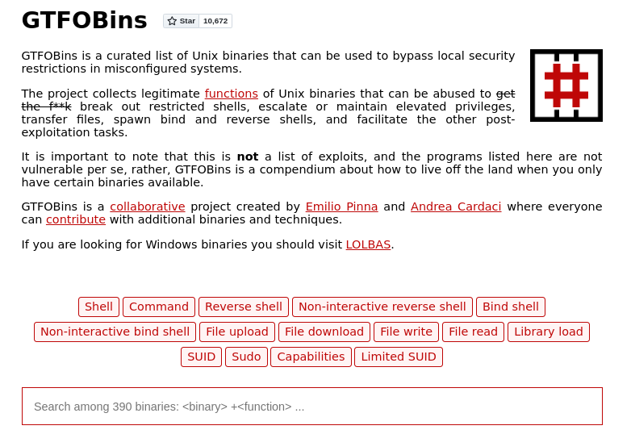
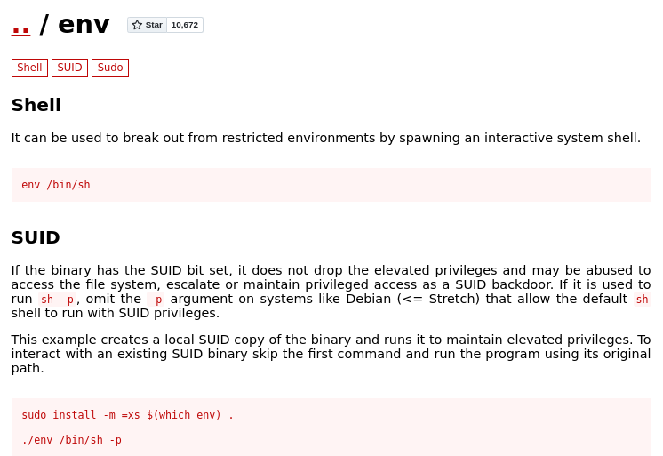

---
title: 'Injection - DockerLabs'
description: "En este WriteUp, abordaremos la máquina Injection de la plataforma DockerLabs. En esta ocasión, abordaremos la máquina Injection. Realizaremos Escaneo de Puertos, Inyección SQL, Acceso a SSH y Escalada de Privilegios."
pubDate: 'Sep 18 2024'
categories: ['WriteUp', 'DockerLabs']
--- 

## Introducción

DockerLabs es una plataforma gratuita diseñada para la práctica de hacking ético. En esta ocasión, abordaremos la máquina Injection. Realizaremos Escaneo de Puertos, Inyección SQL, Acceso a SSH y Escalada de Privilegios.

~~~
Platform: DockerLabs
Level: Very Easy
~~~

## Desplegando la máquina

Primero descargamos la máquina de la plataforma de [**DockerLabs**](https://dockerlabs.es)

Utilizamos una herramienta de descompresión, en mi caso utilizare **Unzip**. Una vez descomprimida la carpeta ejecutamos el comando `sudo bash auto_deploy.sh injection.tar` lo cual ejecutara la máquina.

## Enumeración 

~~~CSS
Target IP: 172.17.0.2
~~~

Usaremos el comando `pinc -c 1 172.17.0.2` para verificar la conectividad con la máquina.  Vemos que el paquete fue recibido y que el **ttl=64** por lo que estamos ante una máquina linux.

Una vez verificada la conexión procedemos a hacer un escaneo de puertos y servicios con la herramienta **Nmap** 

Vemos que tenemos abiertos los puertos **22/tcp ssh** y **80/tcp http**. El puerto 22 SSH (Secure Shell) un protocolo de red que permite la conexión segura a sistemas remotos. El puerto 80 HTTP (Hypertext Transfer Protocol) Se utiliza para cargar páginas web y recursos en navegadores. Ambos permiten la comunicación entre un cliente y un 
servidor. 

Haremos un escaneo mas profundo indicandole a **Nmap** que nos indique las versiones y más informacíon acerca de estos puertos en específico. Usando la flag `-sCV`

Como el puerto 80 está abierto, intentaremos acceder a la página web.

Nos encontramos con un panel de autenticación, donde nos piden usuario y contraseña. Intentaremos credenciales basicas tales como **admin, administrator, etc**.

Como vemos nos dice "Wrong Credentials" lo que nos indica que las credenciales no fueron validas. Probaremos con añadir una comilla al final de la palabra `admin'` 

Esto nos genera un error de sintaxis de SQL. Por lo que deducimos es vulnerable a ataques de **Inyección SQL** y es posible realizar un **Bypass de Autenticación**

## Explotación

**La inyección SQL** es una vulnerabilidad de seguridad web que permite a un atacante interferir con las consultas que realiza una aplicación a su base de datos. Intentaremos realizar el ataque con estos **[Payloads](https://github.com/payloadbox/sql-injection-payload-list)** 

Logré acceder exitosamente con el payload `' OR 1=1-- -` 

Cuando se hace una consulta SQL para verificar las credenciales del usuario se ve algo asi:
~~~SQL
SELECT * FROM usuarios WHERE usuario = 'usuario' AND contraseña = 'contraseña'; 
~~~

Al nosotros introducir `' OR 1=1-- -` como nombre de usuario, la consulta se transforma en:
~~~SQL
SELECT * FROM usuarios WHERE usuario = '' OR 1=1-- - AND contraseña = 'cualquier cosa';
~~~

Aquí, el fragmento `OR 1=1` siempre es verdadero, lo que significa que la consulta devolverá todos los registros de la tabla de usuarios, independientemente de la contraseña. El `--` es un comentario en SQL, lo que ignora el resto de la consulta, así que no importa lo que haya en la contraseña. 

Una vez introducido, nos muestra que ingresamos como el usuario "**Dylan**" y nos indica una contraseña "**KJSDFG789FGSDF78**"

Recordemos que teníamos el puerto **22/SSH** abierto por lo cual podemos intentar ingresar. Ingresamos al ssh mediante el comando `ssh dylan@172.17.0.2`

Una vez ingresada la contraseña logramos acceder exitosamente, con `whoami` comprobamos que somos el usuario dylan.

## Escalada de privilegios

Ejecutamos el comando `sudo -l` para listar los permisos **sudo** del usuario actual pero como vemos no tenemos exitos.

El comando `find / -perm -4000 2>/dev/null` realiza una búsqueda en el sistema de archivos que tengan el bit **SUID (Set User ID)** activado

- **`find /`**: Inicia la búsqueda desde el directorio raíz (`/`), lo que significa que revisa todo el sistema de archivos.

- **`-perm -4000`**: Busca archivos que tengan el bit de SUID activado. Este bit permite que un archivo se ejecute con los permisos del propietario del archivo en lugar de los permisos del usuario que lo ejecuta. El `4000` representa este bit específico.
   
- **`2>/dev/null`**: Redirige la salida de error (cualquier mensaje de error) a `/dev/null`, lo que significa que se descartarán esos mensajes. Esto se utiliza para evitar que aparezcan errores en la pantalla, como los que pueden surgir al intentar acceder a directorios sin permisos.

Utilizaremos [**GTFObins**](https://gtfobins.github.io/) un repositorio y una herramienta online que recopila información sobre binarios de Unix que pueden ser utilizados para explotar vulnerabilidades en sistemas. Su nombre proviene de la frase "Get The F*** Out of Binary", reflejando su enfoque en ayudar a los profesionales de la ciberseguridad a encontrar maneras de escalar privilegios o ejecutar comandos en un sistema comprometido.

Nos enfocaremos en la busqueda de SUID ya que no tenemos permisos de super usuario. 

En primer lugar, buscamos **passwd** y vemos que no hay resultados. Seguimos por **env** y encontramos que es posible escalar privilegios mediante SUID.

Como vemos, nos indica que podemos utilizar `./env /bin/bash -p` para escalar privilegios.

- `./env`: Este es el binario `env`, que se utiliza para ejecutar un comando en un entorno modificado. El prefijo `./` indica que se está ejecutando `env` en el directorio actual.

- `/bin/bash`: Este es el comando que se ejecutará, en este caso, una nueva instancia de Bash.

- `-p`: Esta opción se utiliza para iniciar Bash sin desactivar los privilegios efectivos del usuario, lo que significa que se conservarán los privilegios de usuario elevando el acceso a la shell.

Podriamos usar el comando `which env` para saber en que directorio se encuentra **env**, ya que nosotros no nos encontramos en el directorio **/bin** para ejecutar **./env** modificaremos un poco el comando.

En su lugar, ejecutaremos `usr/bin/env /bin/bash -p`

Una vez dentro ya verificado que somos root hemos obtenido control total del objetivo por ende terminamos la maquina.

