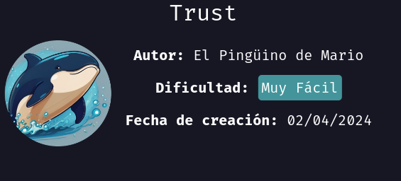
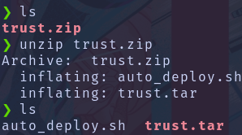
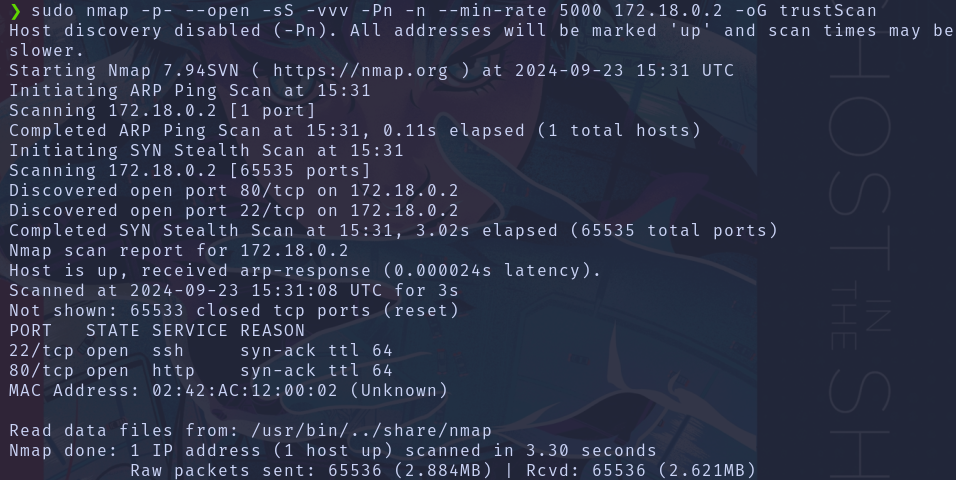
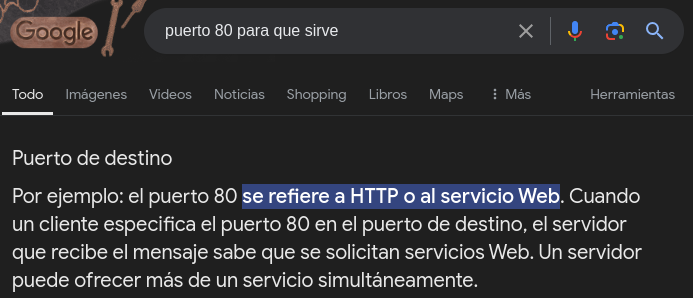
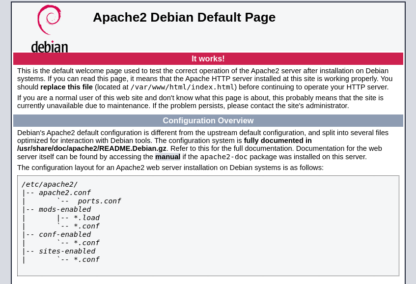
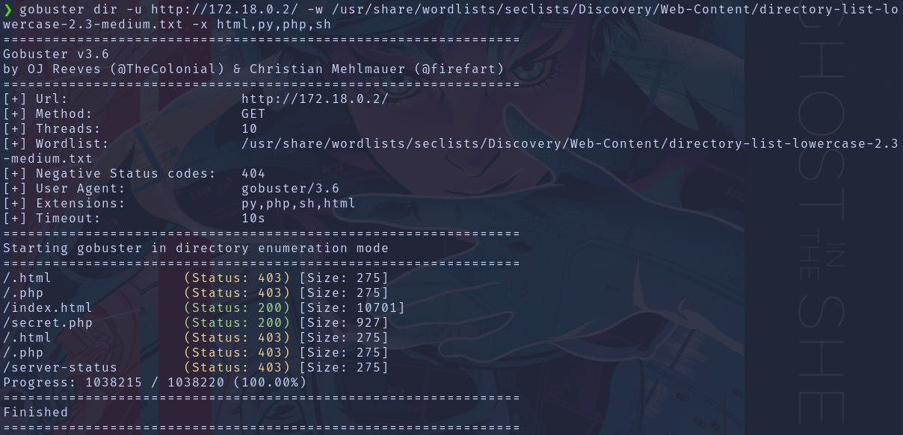
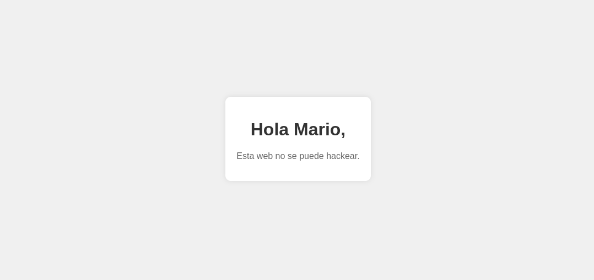

---
title: 'Trust - DockerLabs'
description: "En esta ocasión, abordaremos la máquina Trust de la plataforma DockerLabs. Encontraremos servicios como http y ssh el cual explotaremos mediante fuerza bruta usando hydra y haremos escalada de privilegios."
pubDate: 'Sep 17 2024'
categories: ['WriteUp', 'DockerLabs']
--- 

## Introducción

DockerLabs es una plataforma gratuita diseñada para la práctica de hacking ético. En esta ocasión, abordaremos la máquina Trust. Encontraremos servicios como HTTP y SSH, los cuales explotaremos mediante fuerza bruta usando Hydra y haremos escalada de privilegios.

## Desplegando la máquina

Primero, descargamos la máquina desde la página oficial de [**DockerLabs**](https://dockerlabs.es/).

Una vez descargada, veremos que está comprimida. Procedemos a la extracción mediante una herramienta de descompresión. En mi caso, usaré **Unzip**.

Una vez extraídos los archivos, ejecutaremos la máquina.

## Enumeración 

~~~
Target IP: 172.18.0.2
~~~

Primero, verificaremos la conectividad con la máquina objetivo mediante el comando `ping -c 1 172.18.0.2`.

Una vez verificada la conexión, procedemos a hacer un escaneo de servicios y puertos abiertos con la herramienta de escaneo **Nmap**.

- `sudo`: Ejecuta el comando con privilegios de superusuario.
- `nmap`: Herramienta de escaneo de redes.
- `-p-`: Escanea todos los puertos (del 1 al 65535).
- `--open`: Muestra solo los puertos que están abiertos.
- `-sS`: Escaneo TCP SYN, conocido como escaneo “sigiloso” porque no completa el handshake.
- `-vvv`: Modo muy detallado (muestra más información durante el escaneo).
- `-Pn`: Omite la detección de host (asume que el host está activo).
- `-n`: No resuelve nombres de host (no intenta convertir IP a nombres).
- `--min-rate 5000`: Establece una tasa mínima de paquetes por segundo (aumenta la velocidad del escaneo).
- `172.17.0.2`: Dirección IP del objetivo.
- `-oG trustScan`: Guarda los resultados en formato “grepable” en el archivo `trustScan`.

Vemos que tenemos el puerto `22/tcp ssh` y el puerto `80/tcp http` abiertos.

El puerto **22 ejecuta el servicio SSH** y el puerto **80 el servicio HTTP**. Con algo de información en **Google**, vemos:

Puerto 22/SSH

Puerto 80/HTTP

Intentaremos acceder a la **página HTTP** del objetivo. En la URL de nuestro navegador escribiremos `http://172.18.0.2`. 

Como vemos, nos dirige a la **página predeterminada de Apache**. La página por defecto puede ser un indicativo de que el servidor no está configurado adecuadamente.

Haremos un escaneo de directorios y archivos web mediante la herramienta **Gobuster**. Es un escáner que usa fuerza bruta para descubrir rutas ocultas en un servidor web.

En mi caso, usaré la **wordlist** (lista de palabras) llamada [**Seclists**](https://github.com/danielmiessler/SecLists) (un archivo que contiene una lista de palabras, frases o combinaciones de caracteres que se utilizan en diversas actividades de pruebas de seguridad).

- `Gobuster`: Herramienta de escaneo de directorios y archivos web 
- `dir`:  Modo de enumeración de directorios/archivos
-  `-u`: Se usa para indicar la URL del objetivo a escanear.
- `-w`: Indica la ubicación donde se encuentra la lista de palabras a utilizar durante el escaneo.
- `-x`: Extensiones de archivos a buscar.

Una vez que el escaneo ha finalizado, vemos que nos indica el estado de los directorios. Los que más nos deberían interesar son los de **Status: 200**, ya que significa que son accesibles. **Status: 403** nos indica que el acceso está prohibido.

Podemos ver que hay un directorio PHP llamado **/secret.php**. Ingresaremos para ver qué encontramos. En el navegador ingresamos `http://172.18.0.2/secret.php`.

Nos encontramos con esta página que dice "Hola Mario, esta web no se puede hackear", un mensaje algo divertido y retador. Al parecer, hay un usuario llamado `Mario`.

Recordemos que teníamos también el puerto **22/SSH**, y como tenemos ahora mismo un **usuario**, podríamos intentar acceder mediante **fuerza bruta**.

Utilizaremos la herramienta **Hydra** para ejecutar el ataque de fuerza bruta. En mi caso, usaré el diccionario [**rockyou.txt**](https://github.com/brannondorsey/naive-hashcat/releases/download/data/rockyou.txt).

- `hydra`: Herramienta para ejecutar ataques de fuerza bruta.
- `-l`: Le indica que sabemos el usuario **mario**.
- `-P`: Le indica que queremos saber la **password**; para ello, le indicamos el path del diccionario.
- `ssh://{Target IP}`: Le indicamos que el ataque se realice en el servicio **ssh** de la IP objetivo.

Como vemos, encontró `password: chocolate`, la usaremos para conectarnos al servicio SSH del objetivo.

## Explotación

Accedemos al servicio **ssh** del objetivo mediante la sintaxis `ssh user@{TargetIP}`. Nos pedirá la contraseña; recordemos que es `chocolate`. 

Nos hemos conectado exitosamente al servicio **ssh**, pero como vemos, no tenemos aún el control total. Procedemos a la **escalada de privilegios**.

Ejecutamos el comando `sudo -l` para listar los permisos **sudo** del usuario actual.

Vemos la ruta `/usr/bin/vim`, lo que significa que podemos usar **vim** con permisos de superusuario y, por ende, **escalar privilegios**.

- `sudo`: Ejecuta el comando como superusuario.
- `/usr/bin/vim`
- `-c`: Ejecuta un comando específico antes de abrir el editor
- `':!/bin/bash'`: El comando que ejecuta antes de abrir el editor, le dice a Vim que ejecute un shell **bash**
- `2>/dev/null`: Esto redirige cualquier mensaje de error (stderr) a /dev/null, evitando que se muestre en la terminal.

Una vez ejecutado el comando podemos observar mediante `whoami` si somos root o mediante el comando  `id`

Para tener una shell de bash interactiva podemos ejecutar el script `script /dev/null -c bash`

Una vez dentro ya hemos obtenido control total del objetivo por ende terminamos la maquina.

