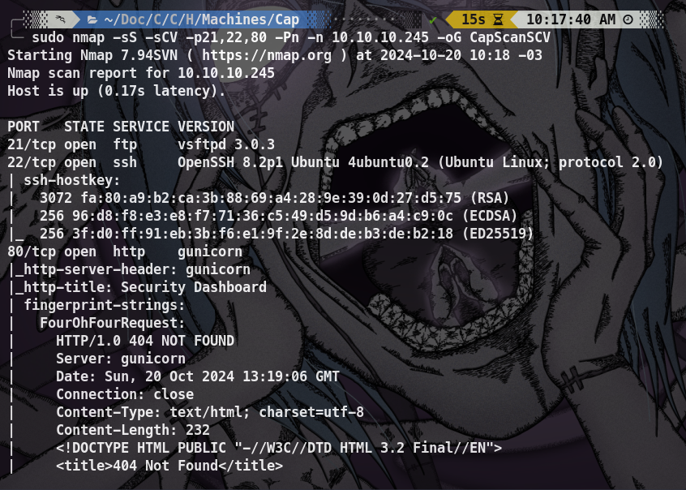
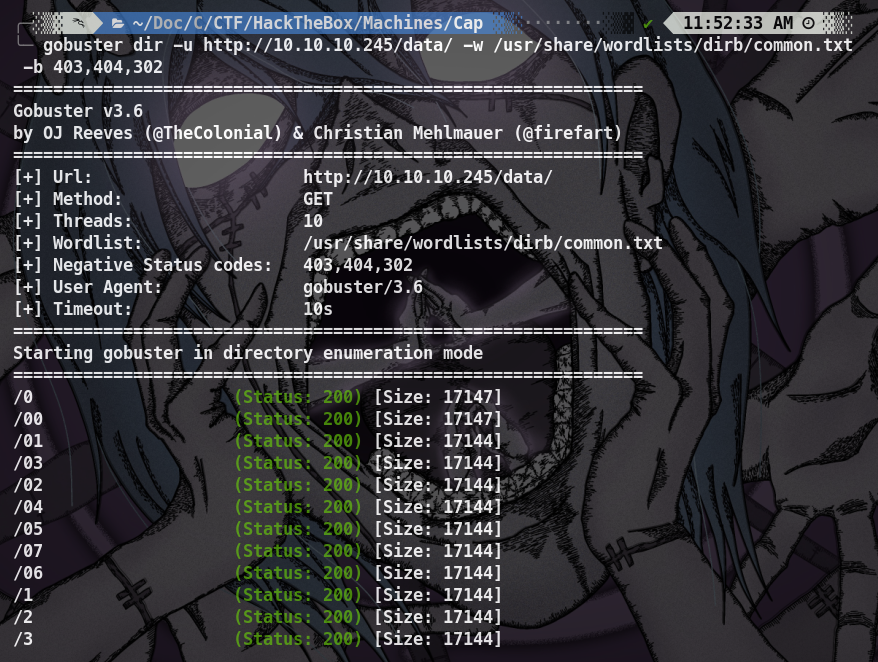
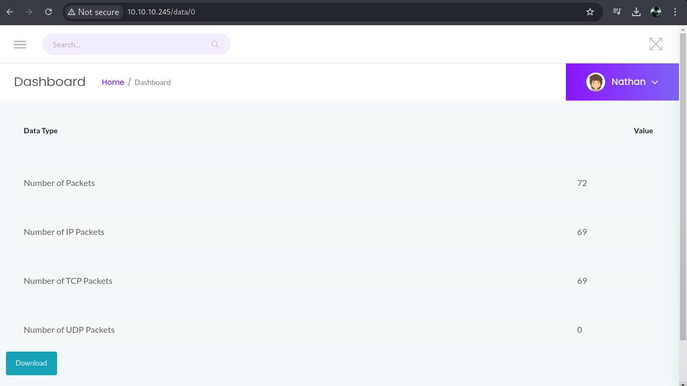
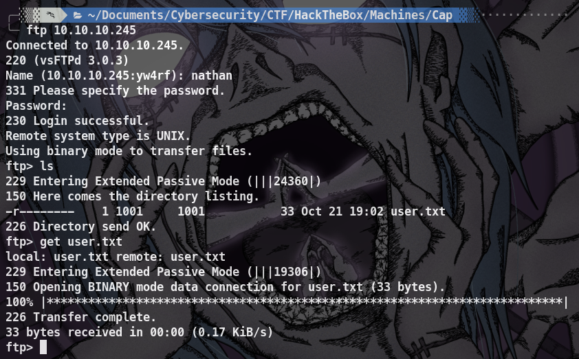
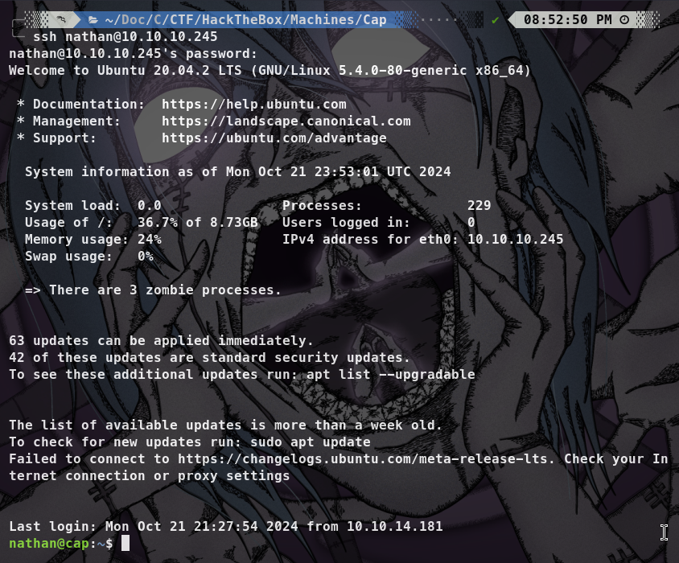
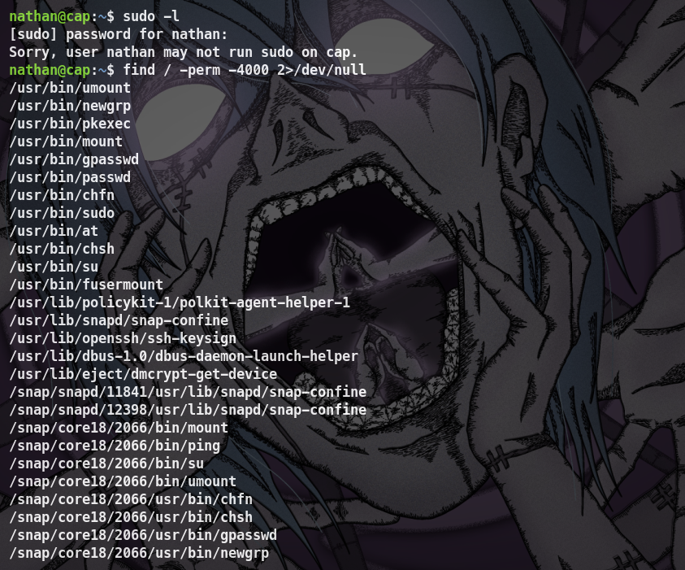
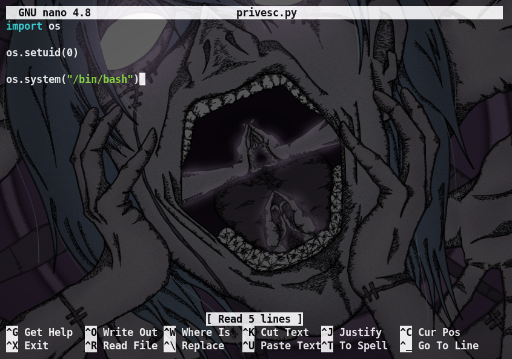

---
title: 'Cap - HackTheBox'
description: "Realizaremos la máquina Cap de la plataforma HackTheBox. Nos encontraremos con varios puertos: 80/HTTP, 21/FTP y 22/SSH. Utilizaremos Tshark para analizar paquetes de archivos .PCAP, Web fuzzing para descubrir directorios o archivos ocultos y escalaremos privilegios mediante la capabilitie cap_setuid."
pubDate: 'Oct 20 2024'
categories: ['WriteUp', 'HackTheBox', 'CTF']
--- 

## Introduction

**[HackTheBox](https://app.hackthebox.com/profile/2035837)** es una plataforma diseñada para la práctica de hacking ético. En esta ocasión, abordaremos la máquina Cap. Nos encontraremos con varios puertos: 80/HTTP, 21/FTP y 22/SSH. Utilizaremos Tshark para analizar paquetes de archivos .PCAP, Fuzzing web para encontrar subdirectorios y escalaremos privilegios mediante la capabilitie cap_setuid.

~~~
Platform: HackTheBox
Level: Easy
OS: Linux
~~~

## Reconnaissance

~~~
Target: 10.10.11.40
~~~

Inicialmente, usamos el comando **Ping**. Este utiliza el **ICMP (Protocolo de Control de Mensajes de Internet)**. Específicamente, **Ping** envía un mensaje de “echo request” a una **dirección IP** y espera recibir un mensaje de “echo response” en respuesta. Este proceso nos permite verificar si una máquina en la red es accesible y medir el tiempo que tarda en recibir una respuesta (conocido como latencia). Ademas, podemos inferir que es una máquina **Linux** debido al **Time To Leave** (**ttl**) que en este caso es **63** (si fuese en su lugar **128** o un número cercano a este, sería una máquina **Windows**)

## Scanning

Como vemos, el paquete fue recibido por la máquina victima. Una vez verificada la conexión, empezamos a realizar un escaneo de multiples etapas con la herramienta **Nmap**. Primero, hacemos un escaneo de puertos abiertos.

Vemos que tenemos los puertos **21/FTP**, **22/SSH** y **80/HTTP**. Procedemos a hacer un escaneo más detallado de los mismos con el fin de obtener más información. Esto lo haremos con la flag `-sCV`

## Enumeration

##### 21/FTP 

La versión del puerto 21 que ejecuta el servicio FTP es **vsftpd 3.0.3**, no encontramos ninguna vulnerabilidad para está versión de momento.

##### 22/SSH

La versión del puerto 22 que ejecuta el servicio SSH es **OpenSSH 8.2p1**, no encontramos ninguna vulnerabilidad para está versión de momento.

##### 80/HTTP

Por lo visto, el puerto 80 ejecuta HTTP, un servidor web **gunicorn**. Haremos uso de **whatweb** para obtener más información acerca del sitio web. Como vemos, es posible acceder al mismo ya que nos reporta el estado "**200 OK**", además nos reporta que utiliza **JQuery 2.2.4** y **Modernizr 2.8.3.min**.

Accedemos al sitio web para obtener más información

Al ingresar lo primero que nos llama la atención es el nombre de **Nathan**. Podemos inferir que es un posible usuario. Además vemos una especie de **Security Dashboard** que reporta **Security Events**, **Failed Login Attempts** y **Port Scans (Unique IPs)** 

Al abrir la barra de navegación nos encontramos con varias secciones **Dashboard**, **Security Snapshot (5 Second PCAP + Analysis)**, **IP Config** y **Network Status** de todas estas la que más nos llama la atención es la segunda **Security Snapshot**

Al ingresar notamos que la **URL** cambia al subdirectorio **/data/1** además vemos que nos indica ciertos numeros de paquetes, también notamos que es posible descargar estos paquetes en un archivo con extensión **.pcap** al parecer este tipo de archivos se utilizan para determinar el estado de la red. Haremos uso de **Tshark** para averiguar que hay dentro del archivo descargado **1.pcap**

No encontramos mucho dentro del archivo **1.pcap**. Haremos **Web fuzzing** con **Gobuster** para encontrar directorios o archivos ocultos. Vemos que hay varios subdirectorios en el directorio **data/** entre ellos **data/0**, **data/00**, **data/01** 

A la hora de ingresar al subdirectorio **data/0** observamos que el numero de paquetes cambia notablemente.

Al descargar el archivo con la extensión **.pcap** notamos que el nombre del archivo cambia a **0.pcap** y a la hora de analizarlo con **Tshark** nos muestra mucha más información.

Hay demasiada información para analizar por lo que filtraremos la misma. Al filtrar por **"ftp"** notamos que en la **linea 40** hay una posible contraseña, recordamos también que teniamos un posible usuario

## Exploitation 

**user**: **nathan**
**password**: **Buck3tH4TF0RM3!**

Intentamos acceder con la contraseña al servicio **FTP** con el usuario y la contraseña. Al ingresar correctamente listamos y encontramos el archivo **user.txt** el cual descargamos en nuestra máquina local. 

Intentamos acceder al servicio **SSH** con las mismas credenciales y funcionó correctamente

## Privilege Escalation

Ejecutamos el comando `sudo -l` para listar los permisos **sudo** del usuario actual y como vemos nos indica que el usuario nathan no puede ejecutar **sudo**.

Intentamos el comando `find / -perm -4000 2>/dev/null` que nos permite realizar una búsqueda en el sistema de archivos que tengan el bit **SUID (Set User ID)** activado y no tenemos mucha suerte tampoco.

Intentamos por **Capabilities**, mecanismo que en sistemas linux permite a los procesos tener permisos especificos sin ser superusuarios. Encontramos que es posible escalar privilegios al intentar explotar **/usr/bin/python3.8 = cap_setuid**  

Para poder escalar privilegios creamos un archivo **.py** que contenga los siguientes comandos:

- **`import os`**: Esta línea importa el módulo `os`, que proporciona funciones para interactuar con el sistema operativo. 
- **`os.setsuid(0)`**: Cambia el ID del usuario efectivo del proceso a 0, que es el ID del superusuario (root). Esto otorga al proceso los privilegios completos del sistema.
- **`os.system("/bin/bash")`**: Ejecuta una nueva instancia del shell de Bash. Dado que el ID de usuario efectivo ha sido cambiado a 0, este nuevo shell se ejecutará con privilegios de superusuario.

Al ejecutar el script con **python3.8** nos permite escalar privilegios exitosamente

Como vemos, somos **root** y por ende tenemos control total del sistema. Hemos finalizado la máquina. Faltaría encontrar las flags.

!

 