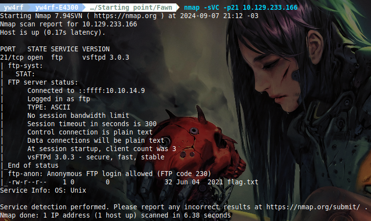

---
title: 'Fawn - HackTheBox'
description: "En este write-up, usaremos Nmap para identificar puertos abiertos y servicios, enfocándonos en FTP en el puerto 21. Vamos a enumerar el servicio FTP, explotar el inicio de sesión anónimo y descargar la flag."
pubDate: 'Sep 4 2024'
categories: ['WriteUp', 'HackTheBox']
--- 


## Introduction

En este write-up, usaremos Nmap para identificar puertos abiertos y servicios, enfocándonos en FTP en el puerto 21. Vamos a enumerar el servicio FTP, explotaremos el inicio de sesión anónimo y descargaremos la flag.

```
Platform: Hack The Box
Level: Very Easy 
```


## Enumeración

```
target: 10.129.97.198  
```
<br>

Primero, usamos el comando `ping -c 1 10.129.97.198` para comprobar la conectividad.


Como estamos conectados, comenzamos con el **escaneo de puertos usando la herramienta Nmap**, con la esperanza de encontrar puertos abiertos y servicios en ejecución:


Como podrás notar, al final del comando Nmap escribí `-oG fawn-scan`, que guarda los resultados del escaneo en formato **"grepable" (salida compatible con grep)**. Este formato es más sencillo y compacto que la salida estándar, lo que nos permite **extraer información específica** fácilmente. Aquí, lo ejecutamos usando el comando **cat**. Podemos ver que el estado es **"Up"** junto con información sobre los puertos y sus versiones.


`21/open/tcp//ftp/vsftpd 3.0.3/` Podemos concluir que el único puerto abierto es el **21**, que ejecuta el protocolo **FTP**, y su versión es **vsftpd 3.0.3**.

## Enumeración de FTP

Para recopilar más información sobre el puerto 21, realizaremos un escaneo específico en este puerto utilizando la bandera `-sCV` de Nmap.



Vemos que dice `ftp-anon: Anonymous FTP login allowed`, hay un archivo llamado `flag.txt`, y estamos en un sistema operativo `UNIX`.


   ```
Anonymous FTP: Este es un método que permite el acceso a un servidor FTP sin necesidad de autenticarse con una cuenta y contraseña. Los usuarios se conectan al servidor utilizando el nombre de usuario "anonymous" (o "ftp" en algunos casos) y cualquier contraseña.
```

Nos conectamos al servidor FTP usando el cliente FTP en el objetivo. Para el nombre de usuario, usamos **Anonymous**, y para la contraseña, en este caso, nada (presiona enter). **Nos conectamos exitosamente al servidor FTP del objetivo**.


## Fase de explotación

Usamos el comando `ls` para listar archivos o directorios.


Una vez que encontramos el archivo `flag.txt`, podemos descargarlo a nuestra máquina local. Después de descargarlo, podemos salir.


Vamos al directorio donde se descargó el archivo `flag.txt`, y podemos abrirlo con el comando `cat {nombre del archivo}`.


<br>

Una vez que capturamos la flag, **hemos completado la máquina Fawn**.


## Resumen

La máquina nos presenta el puerto **21/FTP** abierto, realizamos un escaneo más especifico con la flag **-sCV**  lo cual nos informa que el **Anonymous FTP login** está permitido. Lo que nos permite acceder con el user **anonymous** sin necesidad de una contraseña.

<br>