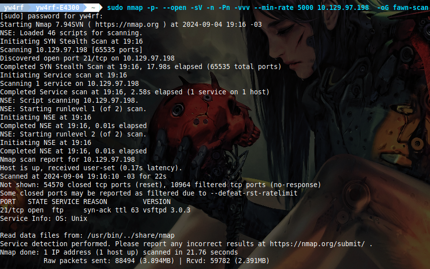

---
title: 'Fawn - HTB'
description: "In this walkthrough, we'll use Nmap for port scanning to identify open ports and services, focusing on FTP on port 21. We'll enumerate the FTP service, exploit anonymous login, and download the flag. This guide covers the technical steps for each phase of the process."
pubDate: 'Sep 4 2024'
categories: ['WriteUp', 'HackTheBox', 'CTF']
--- 


## Introduction 

In this walkthrough, we'll use Nmap for port scanning to identify open ports and services, focusing on FTP on port 21. We'll enumerate the FTP service, exploit anonymous login, and download the flag. This guide covers the technical steps for each phase of the process.
```
Platform: Hack The Box
Level: Very Easy 
```


## Enumeration

```
target: 10.129.97.198  
```
<br>

Primero usamos el comando `ping -c 1 10.129.97.198` para verificar conectividad: 


Como estamos conectados comenzamos con el escaneo de **Escaneo de puertos con la herramienta Nmap** esperando así encontrar puertos abiertos y servicios en ejecución: 



Como notaran al final del comando de Nmap escribí `-oG fawn-scan` esto lo que hace es guardar los resultados del escaneo en formate **"grepeable" (grepable output)**. Este formato es más simple y compacto que el de salida estándar, lo que permite fácilmente **extraer información específica**. Como vemos aquí ejecutamos con el comando **cat**. Podemos ver que el estatus es **"Up"** e información de los puertos y sus versiones. 


`21/opentcp//ftp/vsftpd 3.0.3/` Lo que podemos concluir es que el único puerto abierto es el **21** el cual ejecuta el protocolo **FTP** y su versión es **vsftpd 3.0.3**.

## FTP Enumeration 

Para obtener mas información del puerto 21 haremos un escaneo al puerto en especifico con la flag de nmap `-sCV`


 Vemos que dice `fpt-anon: Anonymous FTP login allowed`, que hay un archivo `flag.txt` y que nos encontramos en un OS (Operating System) `UNIX`.

   ```
 Anonymous FTP: Es un metodo que permite entrar a un servidor FTP sin necesidad de que uno se autentique con una cuenta y contraseña. Los usuarios se conectan al servidor utilizando el nombre de usuario "anonymous" (o "ftp" en algunos casos) y cualquier contraseña.   
```

Conectamos con el servidor FTP mediante el FTP Client del objetivo.
En el usuario usaremos **Anonymous** y en la contraseña en este caso nada (press enter). **Conectamos exitosamente al servidor FTP objetivo**.


## Exploitation phase

Usamos el comando `ls` para enlistar archivos o directorios


Una vez encontrado el archivo `flag.txt` podemos descargar el archivo en nuestra maquina local. Una vez lo hayamos descargado nos podemos ir.


Iremos al directorio en el cual se descargo el archivo `flag.txt`, lo podemos abrir con el comando `cat {nombre del archivo}`


<br>

Una vez tenemos la flag capturada, **hemos completado la maquina Fawn**.


<br>