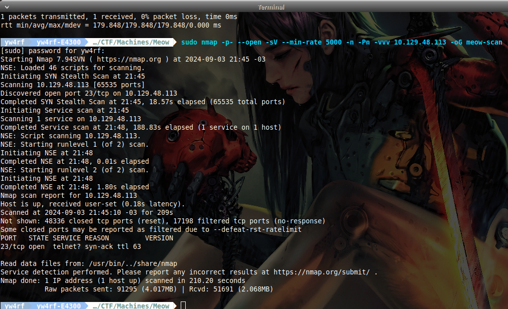
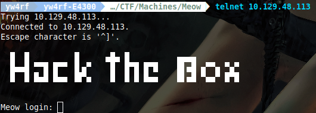

---
title: 'Meow - HackTheBox'
description: "En este write-up, utilizaremos Nmap para escanear puertos e identificar puertos abiertos y servicios, enfocándonos en Telnet en el puerto 23. Enumeraremos, realizaremos ataques de fuerza bruta y descargaremos la flag."
pubDate: 'Sep 3 2024'
categories: ['WriteUp', 'HackTheBox', 'CTF']
--- 

## Introducción

En este write-up, utilizaremos Nmap para escanear puertos e identificar puertos abiertos y servicios, enfocándonos en Telnet en el puerto 23. Enumeraremos, haremos uso de credenciales debiles y descargaremos la flag.

```
Platform: Hack The Box
Level: Very Easy
```


## Enumeración
```
target: 10.129.48.113  
```
<br>

Inicialmente, usamos el comando `Ping`. Este utiliza el **ICMP (Protocolo de Control de Mensajes de Internet)**. Específicamente, `Ping` envía un mensaje de "solicitud de eco" a una `dirección IP` y espera recibir un mensaje de "respuesta de eco" en respuesta. Este proceso nos permite verificar si una máquina en la red es accesible y medir el tiempo que tarda en recibir una respuesta (conocido como latencia).

`ping -c 1 10.129.48.113`


Dado que el paquete fue recibido desde la computadora objetivo, podemos confirmar que está operativo.

A continuación, se realiza un escaneo con Nmap (Network Mapper) para enumerar todos los puertos TCP abiertos en la máquina objetivo en detalle.



`sudo nmap -p- --open -sV --min-rate 5000 -n -Pn -vvv 10.129.48.113 -oG meow-scan`


```
Nmap: Herramienta de escaneo de redes.

-p-: Indica a Nmap que escanee todos los puertos disponibles, del 1 al 65535.

--open: Filtra los resultados de Nmap para mostrar solo los puertos abiertos.

-sV: Habilita la detección de servicios. Nmap intentará identificar las versiones que se ejecutan en los puertos abiertos.

--min-rate 5000: Establece una tasa mínima de 5000 paquetes por segundo para acelerar el escaneo.

-n: Evita la resolución DNS. Nmap no intentará convertir las direcciones IP en nombres de dominio, lo que puede hacer que el escaneo sea más rápido.

-Pn: Desactiva el descubrimiento inicial de hosts ("escaneo de ping") y trata a todos los hosts como si estuvieran activos.

10.129.48.113: Especifica la dirección IP del objetivo a escanear.

-oG meow-scan: Indica que los resultados del escaneo deben guardarse en un formato "grepable" (fácil de filtrar o buscar con comandos como grep). El archivo resultante se llamará meow-scan.
```
<br>

Podemos ver que encontró que el `puerto 23/tcp` está abierto, indicando que el servicio es `Telnet` con la versión `Linux telnetd`.

`PUERTO ESTADO SERVICIO RAZÓN VERSIÓN 23/tcp abierto telnet? syn-ack ttl 63 Linux telnetd`

## Telnet

Con una rápida búsqueda en `Google`, podemos ver que `Telnet` es un protocolo de red que nos permite acceder a otra máquina para administrarla de forma remota como si estuviéramos sentados frente a ella. Generalmente usa el puerto 23 y el protocolo TCP para la transmisión de datos.

Una de las principales desventajas de Telnet es que no cifra los datos transmitidos, incluyendo las credenciales (nombre de usuario y contraseña), lo que hace que las comunicaciones sean vulnerables a ataques de "hombre en el medio" y otras formas de interceptación.

Usando el comando `Telnet` y especificando la `Dirección IP del objetivo`, podemos iniciar sesión en la máquina y realizar un ataque de fuerza bruta.



Después de intentar varios nombres de usuario, como `admin`, `administrator`, se nos concedió acceso sin contraseña utilizando el nombre de usuario `root`.

`Meow login: root`


Una vez que hemos obtenido acceso root en la máquina objetivo, tenemos control total sobre ella.

Con el comando `ls`, verificamos el contenido del directorio actual, donde vemos el archivo `flag.txt`, que es el paso final para completar la máquina. Usando el comando `cat flag.txt`, visualizamos el contenido del archivo y obtenemos la flag.


<br>

Una vez capturada la flag, **hemos completado la máquina Meow**.


## Resumen

La maquina nos presenta el puerto **23/TELNET** abierto, se hace uso de credenciales debiles para ingresar como root finalizando asi la máquina

<br>