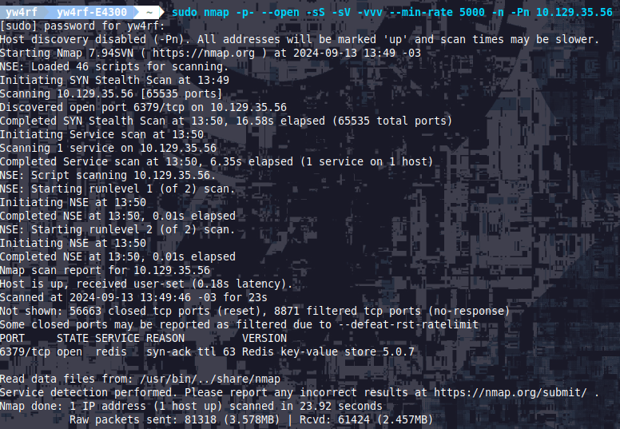
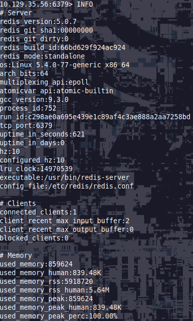
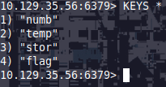

---
title: 'Fawn - HTB'
description: "In this walkthrough, we use Nmap for port scanning to identify open ports and services, focusing on Redis on port 6379. We'll enumerate the Redis service and download the flag."
pubDate: 'Sep 5 2024'
categories: ['WriteUp', 'HackTheBox', 'CTF']
--- 

## Enumeration

Realizamos la comprobación de la conexión con la maquina mediante el comando `ping -c 1 10.129.35.56`


Luego de verificar la conexión, realizamos un escaneo de servicios y puertos abiertos con **Nmap**


Vemos que tenemos un solo puerto abierto, el cual es `6379 ` que corre el servicio `Redis`

```
Redis (Remote Dictionary Server) es un almacén de estructuras de datos en memoria de código abierto, utilizado como base de datos, caché y corredor de mensajes. Los datos se almacenan en un formato de diccionario que contiene pares clave-valor. La base de datos se almacena en la RAM del servidor (en memoria) para permitir un acceso rápido a los datos. Redis también escribe el contenido de la base de datos en el disco a intervalos variables para persistirla como copia de seguridad en caso de falla.
```

En caso de no tener `redis-cli` (Redis Command Line Interface)  instalado en el sistema tendremos que hacerlo. Una vez instalado ejecutaremos `redis-cli --help` para ver que flags nos permite usar



Como vemos podemos usar `redis-cli -h {target ip}` para conectarnos al redis del objetivo


Una vez conectados, podemos usar el comando `INFO` para obtener información de la base de datos Redis




Como podemos observar, la version `redis_version:5.0.7` y que hay en total `keys=4`, esto lo podemos confirmar con `DBSIZE` 


Con `KEYS *` nos muestra todas las **KEYS** de la base de datos Redis



Una vez hayamos visto la flag, para obtenerla podemos usar el comando `GET flag`


Ya con la flag, hemos terminado la maquina. 

